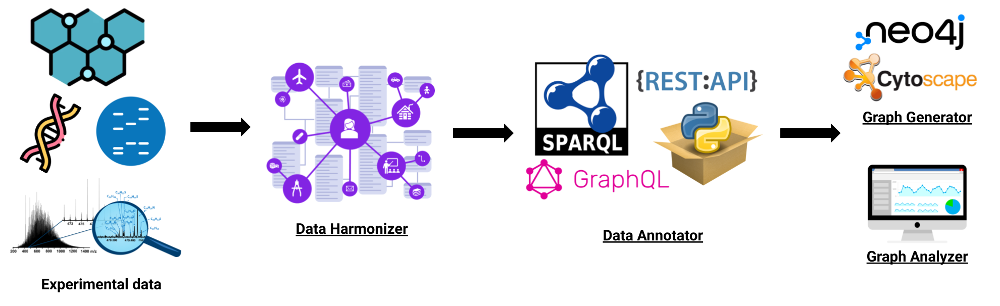

# Introduction

As part of the Biohackathon Europe 2023 in Barcelona, Spain, a dedicated team of seven participants collaborated on Project 17, titled *"Extending interoperability of experimental data using modular queries across biomedical resources"*.

During the biohackathon, we developed a tool named **BioDataFuse** to seamlessly integrate data resources on the fly, thus establishing a modular framework for data wrangling. By following the what-you-see-is-what-you-get (WYSIWYG) convention, BioDataFuse enables users to choose "how" the graph is built based on strategic decisions regarding the data sources of interest. Thus, it creates a context-specific knowledge graphs around the user data.

The tool consists of a backend and a front end framework. The backend
comprises of a Python package, namely [pyBioDataFuse](https://pypi.org/project/pyBiodatafuse/), assisting in supporting various tool functionalities, whereas the user interface acts as the front end enhancing the tool's utility for non-programers.

# Goals for the biohackathon

This project was multifaceted and our objectives was to address following four key aspects to advance the capabilities of *BioDataFuse*.

1. **Extending of the data resources**: Part of the team set out to explore new data sources, subsequently creating annotator modules that adhered to the established structure within the *pyBioDataFuse* package. These annotators sought to enhance the package's capabilities by integrating diverse and valuable biomedical data sources.
1. **Generation of knowledge graphs**: The second major goal of the project was to devise a robust mechanism for transforming the collected data from the annotation phase into a graph data structure. This intermediary step was carefully designed to be Python-native, enabling flexible programmable filtering and manipulation of the graph. This design aimed to achieve a balance between the flexibility of Python-native manipulation and the robust visualization and analytical capabilities offered by widely-used platforms like [Cytoscape](https://cytoscape.org/) [@usesMethodIn:Shannon2003] and [Neo4j](https://neo4j.com/) [@usesMethodIn:noauthororeditorneo4j]. 
1. **Data visualization**: Acknowledging the ability of graphical representation of data, we wanted to extend the capabilities of *pyBioDataFuse* with visualization functions for quick summary of the underlying graph data.
1. **Use case based pipeline**: We wanted to build a stand-to-end pipeline to test and support more types of input for the tool, including but not metabolite and differential gene expression.

The ultimate goal of the *BioDataFuse* project is to evolve into a comprehensive toolkit that empowers users to explore, interpret, and visualize biomedical data seamlessly across a myriad of diverse biomedical resources. By fostering interoperability, *BioDataFuse* ensures that users can effortlessly navigate and extract meaningful insights from their context-specific biomedical graph.

# BioDataFuse framework

Based on our goals described in the previous section, we built the *BioDataFuse* on four main components (Figure \ref{fig-framework}):

1. Data Harmonizer
1. Data Annotators
1. Graph Generator
1. Graph Analyzer 

## Data Harmonizer

Adhering to the FAIR principles, the tool emphasizes the necessity of unique persistent identifiers for diverse biomedical modalities such as genes, chemicals, diseases, etc. Consistent mapping of these entities is achieved through the utilization of the [BridgeDb framework](https://www.bridgedb.org/) [@usesMethodIn:vanIersel2010BridgeDb].

Moreover, we expanded the capabilities the *pyBioDataFuse* to support not only a list of genes as input but also a list of metabolites and data from differential gene expression (DEG). 

The harmonizer step works as the basis for biological entity grounding and mapping and servers as an input for the data annotators as shown in Figure \ref{fig-framework}.

## Data Annotators

We added seven biomedical data annotators that allowed for performing modular queries simultaneously across these resources. The initial selection of these data sources was guided by their content, providing users with the ability to extend the graph based on diseases, compounds or metabolites, biological processes, protein interactions, and scientific publications. 

To be able to concurrently query these resource, we make use of a fast and efficient retrieval capability of **S**PARQL **P**rotocol **A**nd **R**DF **Q**uery **L**anguage ([SPARQL](https://www.w3.org/TR/sparql11-query/)).

In the following subsections, we provide a detailed overview of the integrated data annotators along with their capabilities in *BioDataFuse*:

### Wikidata annotator

[Wikidata](https://www.wikidata.org/) is a structured data resource benefitted by cross sourced curation by individuals and expert. In the context of biology, it support extraction of literature and cellular components information about genes [@usesDataFrom:Waagmeester2020Wikidata].

Technically, we execute a SPARQL query against the [Wikidata Query Service](https://query.wikidata.org/) using the [NCBI Gene](https://www.ncbi.nlm.nih.gov/gene) identifier for genes and proteins of interest. Two methods have been added for data retrieval: the first, `get_gene_literature()`, provides the [PubMed](https://pubmed.ncbi.nlm.nih.gov/) and Wikidata identifiers for the article that has the gene or encoded protein as the main subject. The second, `get_gene_cellular_component()`, returns the Wikidata identifier and label of the cellular component along with its corresponding [Gene Ontology GO](https://geneontology.org/) term.

Thus, this annotator allows us to gather scientific publications and information on the cellular location of the genes or proteins of interest.

### Bgee annotator

[Brain Gene Expression Evolution (Bgee)](https://www.bgee.org/) is a gene expression data resource capturing and collecting data from multiple organisms, with focus on vertebrates [@usesDataFrom:Bastian2020]. All the data collected in the resource is curated by experts thus adding to the confidence in the underlying data.

The annotator supports retrieval of the expression level score and confidence (with `get_gene_expression()` function) from the [Bgee SPARQL endpoint](https://www.bgee.org/resources/sparql) for a given set of genes and anatomical entities where the genes might be expressed. To perform the SPARQL query, [Ensembl](https://www.ensembl.org/index.html) identifiers for genes and the anatomical entities are used.

Hence, though this annotator, we extract the expression profile of the genes in multiple organisms specially mouses, rats, and humans thus allowing users to compare the expression data across the laboratory organisms species which are prominent used in safety and efficacy monitoring of drugs [@usesDataFrom:euclinicaltrials].

### MolMeDB annotator

[Molecules on Membranes Database (MolMeDB)](https://molmedb.upol.cz/) is one of the extensive compound-membrane interactome database that is manually curated and updated with scientific literature [@usesDataFrom:Juracka2019MolMeDB]. 

The annotator for this resource supports extraction of information on transporter protein inhibitors around compounds or metabolites of interest. It uses the [IDSM](https://idsm.elixir-czech.cz/) service, the SPARQL endpoint of MolMeDB, for querying. This resource has a two-way annotation profile that allows capturing molecule inhibitors for genes or vice vera i.e. gene inhibited by molecules. Hence, we developed two methods namely `get_gene_mol_inhibitor()` and `get_mol_gene_inhibitor()` to maximize the utility of MolMeDB. For the first method, [UniProt](https://www.uniprot.org/) TrEMBL and/or [HGNC](https://www.genenames.org/) identifiers are used as input and metabolite/compound inhibitors are described by their name, SMILES, InChIKey, and external identifiers found in [PubChem](https://pubchem.ncbi.nlm.nih.gov/), [ChEMBL](https://www.ebi.ac.uk/chembl/), [ChEBI](https://www.ebi.ac.uk/chebi/), [DrugBank](https://go.drugbank.com/), and MolMeDB. Additionally, the literature reference (in the form of DOI or PubMed identifiers) from which the data was capture is also provided. For the second method, metabolite or compounds are searched based on InChIKey since SMILES are not unique for compounds.

Thus, this resources enables capturing of membrane interacting molecules allowing for deeper dive into the adsorption profile of compounds of interest.

### Open Targets annotator

[Open Targets](https://www.opentargets.org/) is a public-private partnership project that focuses on drug target identification and prioritization to advance drug discovery and development [@usesDataFrom:Ochoa2022]. It does so by integrating large scale omics data like functional genomics and chemogeneomics with drug and pathway based information.

The annotator is built on the [GraphQL API](https://platform-docs.opentargets.org/data-access/graphql-api) of [Open Targets Platform](https://platform.opentargets.org/). Given the different dimensions of data that can be extracted, we built large number of functions to extract the genes relevant information including its tractability (`get_gene_tractability()`), its involvement in different biological pathways (from [Reactome](https://reactome.org/) and GO with `get_gene_reactome_pathways()` and `get_gene_go_process()` respectively), the diseases it is prominent correlated with (`get_gene_disease_associations()`), as well as the drug that target the gene (`get_gene_drug_interactions`). For each of the above mentioned queries, the Ensembl identifier for the gene is used.

Overall, this annotator serves as the basis for enrichment of gene related metadata from different modalities. Furthermore, since the data in Open Targets is integrated from more than 10 resources, thus allowing us to query one collected resource, rather than 10.

### DisGeNET annotator

[DisGeNET](https://www.disgenet.org/) is a knowledge platform that integrates information on the genetic basis of human diseases. It provides a wealth of data related to the relationships between genes and diseases, facilitating the exploration of the molecular mechanisms underlying various disorders [@usesDataFrom:QueraltRosinach2016DisGeNETRDF]. 

By using the [DisGeNET API](https://www.disgenet.org/api/#/gene), we built the annotator. For a given set of Entrez/NCBI Gene identifiers, the `get_gene_disease()` method extracts the diseases related to the gene of interest. Together with the disease, metadata of the edge connection i.e. the source from which the data was extracted, the year, and the DisGeNET score for the connection is retrieved. 

Thus, the resource allows for annotation of genetically related diseases for the genes as well as selection thresholds that allow for filtering the diseases based on the metadata.

### WikiPathways annotator

Apart from Reactome and GO databases, another popular resource for pathways is [WikiPathways](https://www.wikipathways.org/). It is an open, collaborative platform that provides a community-driven approach to curating and disseminating biological pathways [@usesDataFram:Agrawal2023WikiPathways].

- [ ] Add annotator para

- [ ] Add what this add to the pipeline

### STRING annotator

[Search Tool for the Retrieval of Interacting Genes/Proteins (STRING)](https://string-db.org/) is a bioinformatics database and web resource that focuses on the exploration and analysis of protein-protein interactions (PPIs) [@usesDataFrom:Szklarczyk2023stringdb]. It collections this information based on functional associations between proteins, complementing the genetic association.

- [ ] Add annotator para

- [ ] Add what this add to the pipeline

## Graph generator

The graph generator serves the fundamental purpose of creating the knowledge graph (KG) from the data captured by the annotators, hence allowing for visualization of complex connections within a dataset. The KG consists of nodes (representing entities or data points) and edges (indicating relationships or interactions) in a clear and structured manner revealing patterns, clusters, or trends within interconnected datasets, aiding researchers, analysts, and decision-makers in gaining insights. 

### Schema of the graph

We built a Python module in *pyBioDataFuse* (`class pyBiodatafuse.graph()`) to create a graph data structure from the aggregate data (Figure \ref{fig-graph-model}). Utilizing the [NetworkX](https://networkx.org/) [@usesMethodIn:SciPyProceedings_11] library, this module generating the graph and seamlessly exports it to Cytoscape and Neo4j for visualization. Within the KG, nodes represent distinct biological entities, such as genes, diseases, drugs, and pathways. Each node is enriched with attributes (metadata), offering details about its origin. For instance, gene nodes include information about the gene's source, identifiers, and associated attributes. The edges connecting the nodes signify diverse interactions and associations encompassing gene-disease relationships, gene-pathway connections, and gene-drug interactions. Edge nomenclature adheres to the RDF format, ensuring a structured representation for a comprehensive understanding of the complex interplay between different biomedical elements.

### Input-output (IO) dynamics for the graph

The python native graph data structure (obtained using NetworkX) allows for programmatic filtering and manipulation of the graph. Simultaneously, the graph acts as an intermediary stage, ready to be serialized into two alternative formats. The first format complies with Cytoscape's specification in JSON, allowing its integration with Cytoscape. The second format is GraphML, compatible with Neo4j and can be effortlessly loaded using the APOC extension [@usesMethodIn:neo4japoc].

A specific module was developed to export the KG to GraphML and load it into a live deployment of Neo4j (`graph.neo4j_exporter.export()`). This function connects to the Neo4j database via the Neo4j Python driver using the user specified credentials (i.e. username and password) and a provided URI (Uniform Resource Identifier) pointing to the active/running database instance. The graph is then imported into the Neo4j database via the import functionality of the Neo4j APOC plugin, where each node is assigned a specific label based on its type. 

## Graph Analyzer

To provide a quick summary of the data generated by the *BioDataFuse* pipeline. To do so, we leveraging Python packages such as the [Matplotlib](https://matplotlib.org/) [@usesMethodIn:Hunter2007], [Seaborn](https://seaborn.pydata.org/) [@usesMethodIn:Waskom2021], and [Plotly](https://plotly.com/). Using these tools, we built basic plots like a pie chart (`plot_pie_chart()` and `plotly_pie_chart()`) and bar plots(`plot_hbarplot_chart()` and `plotly_barplot_chart()`).

Additionally, a more generic network-specific summary was also added. This was done by iterating through all node and edge types, which can be useful, in order to generate data type specific summary for e.g. visualizing protein-protein interaction networks, node statistics.

- [ ] CHECK THIS PART!

Finally, two simple use cases were explored for community detection on the STRING [@usesDataFrom:Szklarczyk2014] interaction subgraph and for link prediction on the gene - disease subgraph. However, the simple link prediction method used, based on Jaccard coefficients, requires an undirected graph, meaning it is not suitable for the gene-disease use case. In particular, the method predicts associations between different diseases, as opposed to gene - disease predictions. Therefore, as future work, a method specific to bipartite graphs should instead be investigated. An example to be further explored can be found here. Futhermore, experiments with larger datasets would be required in the future.

## Pipeline testing

To ensure that all the functions enlisted in the previous sections are working smoothly, and to capture any functional failures, we wrote tests scripts for each resource. This test script ensures the stable connection between the resources for query. Additionally, we integrate the testing as part of [GitHub Actions](https://docs.github.com/en/actions/using-workflows), such that every time a push to the main repository tests the connectivity with all the annotators thus providing an easy way to test and restore lost connections.

During initial testing of the resource, we found that there were cases of one-to-many mappings for genes in BridgeDb (eg. from HGNC to UniProt TrEMBL). We raised this issue with the BridgeDB developers (also a co-author of this paper/project) and it is currently being traced down for fixes.

## User interface

- [ ] Add in data here
[Streamlit](https://streamlit.io/)

## Future work

The following are the planned future directions of the work:

- Supporting more types of input data (e.g. gene co-expression data).
- Addition of annotator from drug databases like [PubChem](https://pubchem.ncbi.nlm.nih.gov/) and [ChEMBL](https://www.ebi.ac.uk/chembl/).
- Connection of larger data repositories like those hosted in the [Database Center for Life Science (DBCLS)](https://dbcls.rois.ac.jp/index-en.html) into *BioDataFuse*.
- Constant updating and versioning of [*pyBioDataFuse*](https://pypi.org/project/pyBiodatafuse/) at PyPi with the above-described annotators.
- The current user interface is Streamlit, but to improve its functionality, we would migrate towards [Shiny](https://shiny.posit.co/) or [Dash](https://plotly.com/dash/) frameworks.
- Addition of functionality for live loading of graph to Cytoscape similar to that of Neo4J.

# Discussion

During the BioHackathon, our team accomplished significant milestones with *BioDataFuse*. The tool now accommodates additional input types and incorporates a more extensive range of biomedical data sources. The creation of context-specific knowledge graphs is a notable achievement, and these graphs can be visualized in both Cytoscape and Neo4j, enhancing accessibility and usability.

However, in terms of the graph analyzer component, there are areas that still require attention. We recognize the importance of refining and expanding this aspect of the tool. Through successful collaborations initiated during the Biohackathon, we aim to improve not only the graph analyzer but also other components by implementing the workflow on specific use cases. This collaborative effort is pivotal in addressing the remaining tasks and ensuring the comprehensive functionality of BioDataFuse.

In addition, the user interface requires additional refinement. We are planning to transition away from Streamlit and explore alternative tools such as Dash to enhance functionality and user experience.

# Contributions to the package

We always are open to community contributions in making the package better. Thus, we invite interested contributor to parsing and adding relevant annotators, perform visual analysis on the graph or data, or advice us in the development of stable web interface for *BioDataFuse*. If this is something that is interesting to you, simply open an issue on our [GitHub repo](https://github.com/BioDataFuse/pyBiodatafuse) and we would be happy to discuss future prospects. 

## Acknowledgements

This work was supported by ELIXIR, the research infrastructure for life-science data. We thank the organizers of the BioHackathon Europe 2023 for providing travel support for the project leads.

## References
